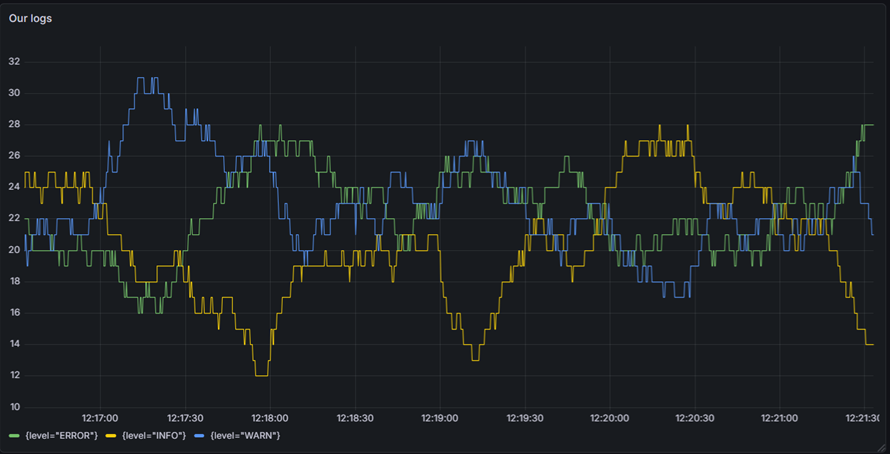

# Loki Log Monitoring Stack

An automated stack for collecting and visualizing logs.

## Description
The project is a fully functional monitoring pipeline:
1. **Python Logger**: Generates logs at different levels (INFO, WARN, ERROR).
2. **Promtail**: an agent that reads logs from a file in real time.
3. **Loki**: a central log repository.
4. **Grafana**: a dashboard for visualizing data streams in real time.

## Visualization


## Structure
- `docker-compose.yml`: service orchestration.
- `dashboards/dashboard.json`: dashboard export for quick deployment.
- `chaos.py`: test load generator.

## How to run
```bash
docker-compose up -d